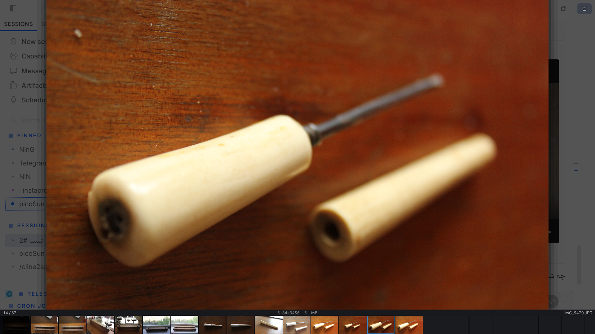

# picoSun2

A fast, minimal photo viewer for Windows. Built with Rust and egui.



## Features

**Fast photo loading**
- Full resolution, no downscaling
- Multi-threaded RAW demosaic (26MP ARW in ~4s)
- Instant paging on cached photos (LRU-8)
- Per-folder cache in a hidden `.p2cache/` folder — cold reload drops from 8.9s to 0.5s

**Filmstrip**
- Bottom strip shows all photos in the folder
- Current photo outlined in blue
- Placeholder tiles appear immediately, decode in the background
- Scroll the strip to page through photos
- Dedicated tile pool — thumbnails never starve the main photo decode

**Supported formats**
- Photos: JPG, PNG, GIF, WebP, BMP, TIFF, HEIC, AVIF, and 50+ more
- RAW: ARW, CR2, CR3, NEF, DNG, ORF, RAF, RW2, and 40+ more
- HDR: EXR, HDR, PFM, FITS
- Animated: GIF, APNG, WebP

**Navigation**
- Arrow keys or wheel to page
- Ctrl+wheel to zoom, drag to pan
- R to rotate, H to flip
- Ctrl+T toggles the filmstrip
- F for fullscreen

**Open with**
- Registered as OpenWith for all photo and RAW formats
- Never hijacks your default apps

## Install

Download `picoSun2-setup-2.0.0.exe` from the [latest release](https://github.com/Nim4a/picoSun2/releases/latest).

Or grab the portable `picosun2.exe` directly.

## Cache

The first time you open a photo, picoSun2 caches the decoded result as a PNG inside a hidden `.p2cache/` folder next to your photos. The next open is near-instant.

- One hidden folder per photo folder — your photo folder stays clean
- Stale entries are detected automatically (source file mtime + size check)
- Delete the `.p2cache/` folder anytime to reclaim space

## Build

Requires Rust and the w64devkit toolchain.

```
cargo build --release
```

The installer requires NSIS:

```
cd installer && makensis picoSun2.nsi
```

## License

MIT
